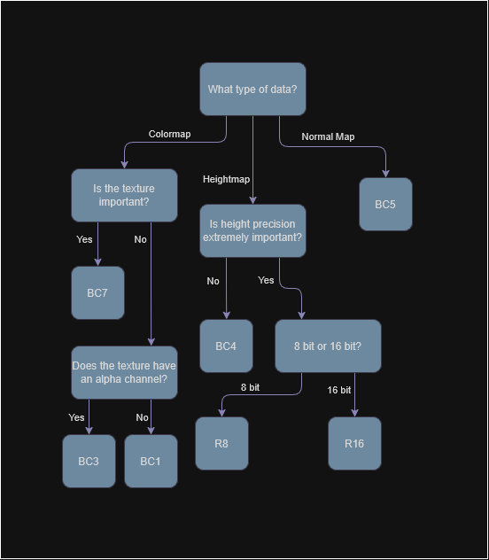
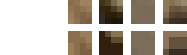
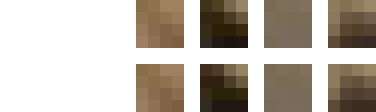
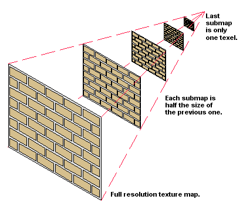

# DDS Format Guide
*Written by ballisticfox*



You've probably heard of image formats before, .png, .jpg, .webp, maybe even .dds. An image format at the most basic level is simply an agreed upon structure (usually created by some very smart people) on how to encode image data in some specific way. Different image formats are often tailored to very specific tasks, and it's important to use the correct format in your work.

Sometimes, an image format contains a wider specification of subformats, with each subformat being even further tailored for a specific applications. These image formats are often called "container formats", and it's just as important to choose the right subformat that fits your texture's needs.

---

### What is DDS?

The DirectDraw Surface format was developed by Microsoft in 1999, as a high performance alternative to jpg and png in regards to GPUs. Since then it's grown to be the industry standard for compressing textures, with a wide variety of subformats, support for special texture types like arrays and cubemaps, and various other nifty features to help the GPU such as mipmaps.

When a png or jpg texture is requested on the GPU, the CPU must first decompress this data into its raw bytes in RAM, next this raw byte array is then compressed into a format that the GPU can properly read (this is done by Unity), then this compressed texture is transferred into VRAM and bound to a texture slot, with the final result being a texture in VRAM that can then be sampled in the shader. This process is time consuming on both the CPU and GPU, and you're often giving up far more storage than you really need.

In contrast, DDS acts a direct pipeline to the GPU, the texture is loaded into RAM, and then directly given to the GPU without any decompression or recompression required. Furthermore these textures are often "Block Compressed" (these are often denoted by BC*n*), meaning the image is chopped up in small 4x4 squares, which allow the GPU to load chunks of data at a time, improving sampling speed and memory usage.

>  [!TIP]
> You can learn more about DDS and block compression [here](https://www.reedbeta.com/blog/understanding-bcn-texture-compression-formats/).

---

### Lossy vs Lossless

DDS textures (specifically BC*n* textures) undergo lossy compression when they are encoded, this sacrifices *ideally* minute, unnoticeable detail in exchange for much lower storage sizes.

A PNG texture loaded on the GPU will more than likely undergo a conversion to a RGBA32 format. The 32 means that for every pixel on the image, 32 bits are dedicated to representing it, or 4 bytes. Compare that to a BC1 texture which only used 0.5 bytes per pixel and you're looking at a 8x reduction in VRAM.

It's clear why we'd use DDS here, but what's the downside?
1. You'll have to save a development copy of your planets.

    Every time you make an edit to your world, you'll need to re-export it to save your changes. This will trigger another block recompression if you export as DDS, "crunching" your maps further.

    I'd personally advise you to save a .png or a .tif copy of your maps, edit that, then use the commands and the bottom of this guide to compress your data when you're ready to load the game.

2. Sometimes you want lossless.

    When working with heightmap data specifically, your options for DDS are pretty limited. BC4 is the standard but it can cause some nasty artifacting in scenarios where height accuracy is necessary.

    I actually keep two heightmaps per planet for Sol, one is R16 and kept on the CPU/RAM side by only using it for the PQS, and one is BC4 and is only used in scaled space via Parallax Scaled. It's entirely possible you may only need a BC4 map though!

    Another example is sometimes you want to store very specific types of data, this could a heightmap or a normal map or perhaps some sort of flow map. DDS is going to try its best to make the data "look" the same, it doesn't care about precision, it doesn't care about the fact you're encoding a vector, its only job is to make it "look" similar

<br>

Example of data loss from different types of DDS compression :






*(Credit Nathan Reed)*

---

### Mipmapping



Another major benefit of DDS textures is their native support for mipmaps.

While our textures on disk might be flat grids, when we project them onto a 3D plane we often get grazing angles or want to view our data from long distances. Without mipmapping this causes what's called "aliasing" and "moire patterning" due to the GPU overdrawing textures in a small space. Mipmapping seeks to prevent this by saving your original image at 1/2, 1/4, 1/8, 1/2^n resolutions. When the texture is taking up less screen space than a "mip level" requires, it'll drop down a level, lowering the number of samples needed and improving performance.

> [!NOTE]
> The process of mathematically controlling these lower miplevels is called filtering.
>
> This is where bilinear, trilinear, and ansiotropic filtering come from.

There are almost no downsides to mipmaps. They do increase your size on disk by 33%, however this is worth it in exchange for the much higher performance they provide. The only scenario where you shouldn't use mipmaps is in the case of a CPU-only texture like a heightmap that's only used for the PQS.


---

### DDS For KSP

Using the correct DDS format is extremely important in your pursuit for high quality and high performance planets.

The formats most relevant to KSP are as follows:

| Format        | Channels           |  bytes / px  | Usage                     | Notes |
| :---          |    :----:             |     :----:   |        :----             | --- |
| BC1 (DXT1)    |   RGB + 1-bit alpha   |   0.5        | Legacy/Low Cost Colormaps | Relatively bad compression quality when compared to BC7 or BC3 |
| BC3 (DXT5)    |   RGBA                |   1.0        | Legacy Colormaps          | Okay compression quality |
| BC3n (DXT5nm) |   RGA                 |   1.0        | Legacy Normal Maps        | Uses alpha to reconstruct the vector in R, this hurts the green channel significantly |
| BC4           |   L/R                 |   1.0        | Heightmaps (Lossy)        | Okay compression quality, you may want R8 or R16 for full detail for PQS |
| BC5           |   RG                  |   1.0        | Normal Maps               | Good compression quality, use this over BC3n |
| BC7           |   RGBA                |   1.0        | Colormaps                 | Best compression quality, unsupported on MacOS OpenGL
| R8            |   R                   |   1.0        | Heightmaps (8b, Lossless)  | Use if you need a uncompressed version of your heightmap for PQS |
| R16           |   R                   |   2.0        | Heightmaps (16b, Lossless) | Use if you need a uncompressed 16 bit heightmap for PQS, do not use unless you really need to |

> [!CAUTION]
> The MacOS version of KSP is locked to an old version of OpenGL which doesn't support `BC7` textures.
>
> They will still load, however they'll be parsed as `RGBA32` instead of as proper `BC7`.

---


### How to DDS?

Previously it was recommended to use Nvidia Texture Tools for loading and exporting of textures, however it struggles significantly with 16k textures and is generally just not very fast compared to modern alternatives.

I personally recommend [texconv](https://github.com/microsoft/DirectXTex/releases) as it supports all of the latest formats, is being actively  maintained, and is extremely fast with the caveat that it is a command line tool.

The following instructions are for Windows, if you're on linux, you should be capable of following along similarly but you'll need [this version](https://github.com/matyalatte/Texconv-Custom-DLL).


To install
- Make a folder somewhere on your PC to hold the texconv executable, mine is just on my desktop.
- Place `texconv.exe` in that folder.
- In the windows search bar, type in 'env' and hit `Edit System Environment Variables`, press `n`.
- Look under the `User variables for ---` and find the `Path` value, double click on the value box.
- Press new, then copy the path from your previously created folder into this box, hit ok until all the windows are closed.

Open up command prompt and type in `texconv`, you should see the command arguments page appear.

To use texconv, you simply type in `texconv` followed by your command arguments, followed by your texture name, below I've listed out all the command arguments that may be useful:

| Argument        | Usage             |
| :---          |    :----:           |
| -m    |   Mipmap levels. Texconv will automatically make mipmaps, to disable mipmaps do -m 0 |
| -srgb |   Ensures that the texture is treated as srgb on load and on export, use for colormaps
| -o    |   Specify an output directory, otherwise it'll write to the current location with the same filename except as .dds
| -y    |   Overwrite on disk, if this isn't set it'll halt if the texture already exists
| -sepalpha | Generates alpha mipmaps separately from the normal mipmaps. HIGHLY RECOMMENDED IF YOU HAVE ALPHA.
| -wrap | Texture addressing mode, use -wrap for equirectangular textures
| -bc x | Maximum compression effort, only valid for BC7
| -bc u | Equal channel compression effort, use if you're compressing non-color data into channels
| -f    | Specifies a specific texture compression format


Here is a list of all the relevant compression format options:


| Format          | Usage                       | Code |
| :---            |        :----                | --- |
| BC1 (DXT1)      | Legacy/Low Cost Colormaps   | BC1_UNORM
| BC3 (DXT5)      | Legacy Colormaps            | BC3_UNORM
| BC3n (DXT5nm)   | Legacy Normal Maps          | BC3n or DXT5nm
| BC4             | Heightmaps (Lossy)          | BC4_UNORM
| BC5             | Normal Maps                 | BC5_UNORM
| BC7             | Colormaps                   | BC7_UNORM
| R8              | Heightmaps (8b, Lossless)   | R8_UNORM
| R16             | Heightmaps (16b, Lossless)  | R16_UNORM


---

### Scripts


Assuming you followed the instructions above, you now have a folder on path you can put scripts into!

You can download my scripts [here](https://drive.google.com/file/d/1rOh0IJcvccD44zb7Tb7s8agnLtwXNw96/view?usp=sharing) and place them in that folder.

To convert, open the folder of wherever you save your textures, in the address bar at the top type in cmd to open command prompt in that folder, then type the name of the script you want to run followed by the image name.

For example, if I want to compress `myColorTexture.png`, I open command prompt in that folder, type in `colormap myColorTexture.png` and then hit enter. A fresh, ready-to-use DDS texture has been created just for you!

Making your own scripts is just as easy too:
```bat
@echo off
if "%~1"=="" (
    echo Usage: script_name ^<texture_file^>
    exit /b 1
)
texconv.exe {ARGS_HERE} "%~1"
```

---

### Closing Remarks

Hopefully this guide has given you enough information to start working with DDS textures yourself and has given you a proper understanding of their benefits rather than simply tolerating them.

If you have any questions, you can always ask on the Kopernicus discord!