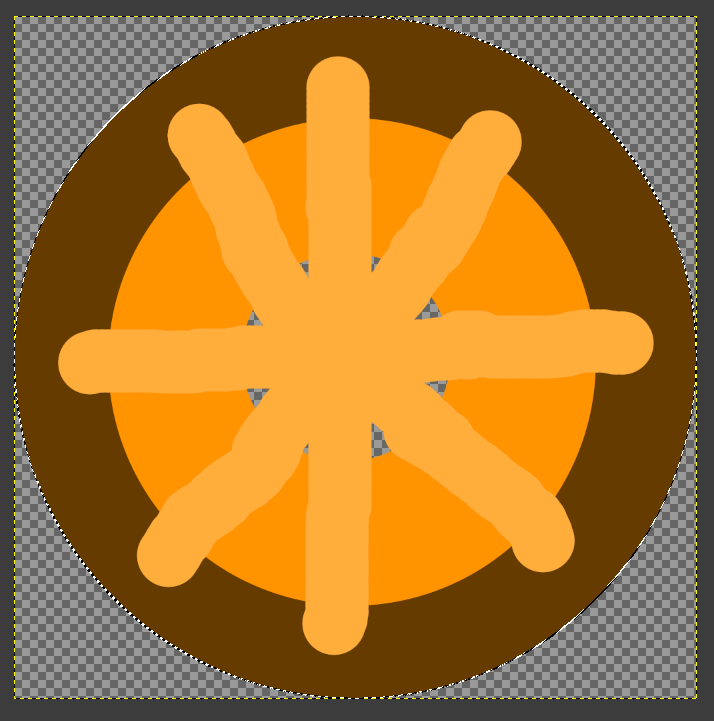
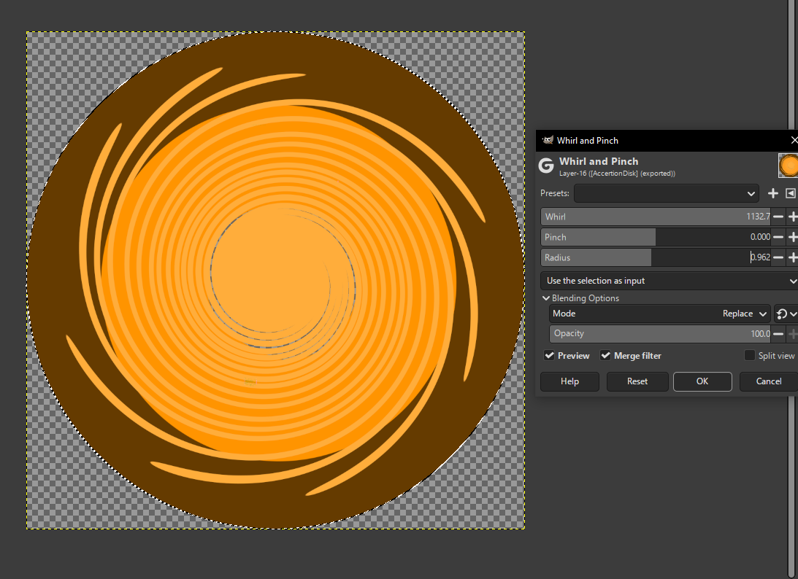
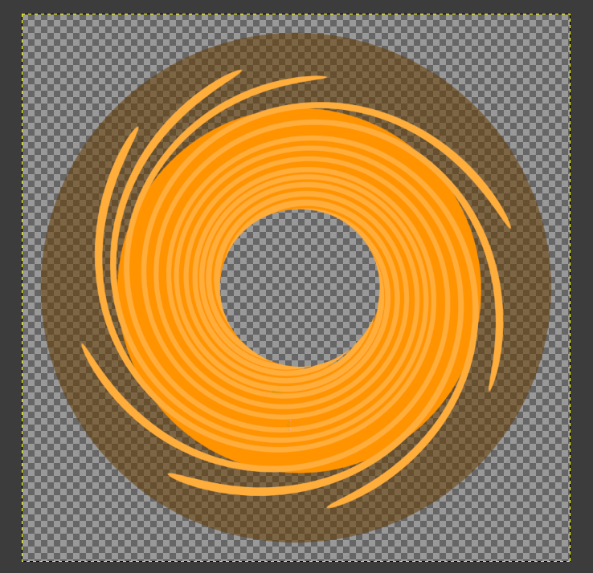
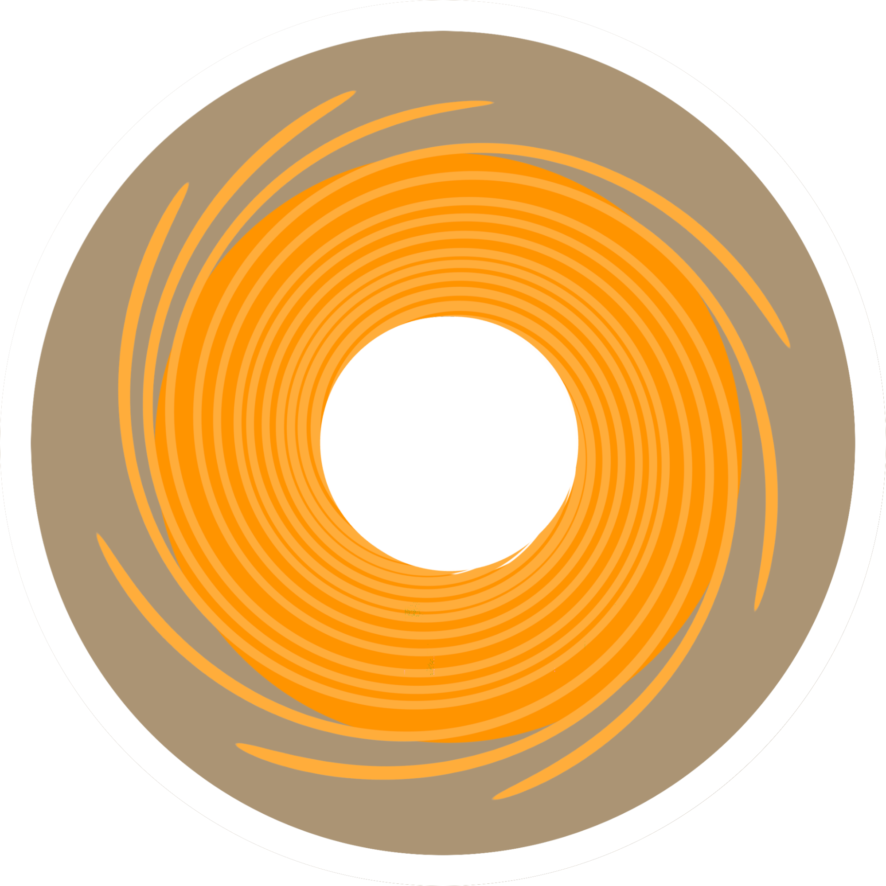
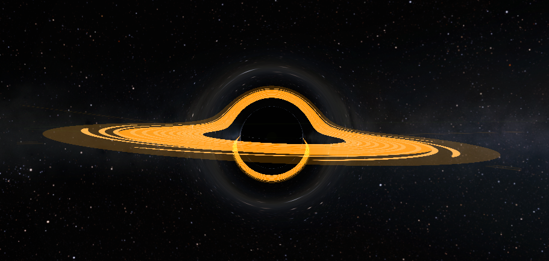

# Singularity
*Written by Surnus*

Singularity is a mod that adds blackhole/wormhole shaders into KSP. It allows you to make big/small blackholes, wormholes inside of KSP. Which is not in the stock game by itself.

For this guide, you will need:
* Kopernicus and all of its dependencies, and
* Singularity and all of its dependencies.

Starting off with the Kopernicus Body of your blackhole.

Make a Base kopernicus body just how you would make a Gas giant, but do not include the material sub-node in scaled Version.

* Include all base nodes such as:
  * Template (Jool for wormholes, and star for blackholes.)
    * don't forget to remove the atmosphere if using Jool, and coronas if using Sun.
  * A Properties node. Now here, make the size 1000 or less. The smaller the better.
  * Orbit nodes are pretty easy to make, use it just like you are making a planet.
  * The ScaledVersion for both wormholes and blackholes are provided:
    ```cfg
    ScaledVersion
    {
        invisible = true
    }
    ```

This is an example config for a wormhole as a Kopernicus planet.

```cfg
@Kopernicus:AFTER[Kopernicus]
{
    Body
    {
        name = Wormhole1
        cacheFile = Path/To/Your/Cache/Wormhole1.bin
        Template
        {
            name = Jool
            removeAtmosphere = true
        }
        Properties
        {
            // name it anything with ^N (so it doesn't look weird in science reports)
            displayName = Wormhole1^N
            // a radius of 1000 is recommended, you can go even smaller if you want.
            radius = 1000
            // use any other description or delete it, depends on what you want.
            description = you can include whatever text you want here!
            // The sphere of influence of the blackhole/wormhole should cover the entire Singularity. (The outer effect).
            sphereOfInfluence = 40000000
        }
        Orbit
        {
            referenceBody = Sun // you can change it how ever you want
            semiMajorAxis = 548957437463
        }
        ScaledVersion
        {
            invisible = true
        }
    }
}

```

After that, you need to make these:

* Make a folder inside your mod's Folder.
  * name the Folder you made "Singularity"
  * Make a new Config and call it Singularity

After that, you will start the Singularity config with:

```cfg
Singularity
{
    // your code will be here
}
```

You will need to add the Singularity Object that you want to turn into a womrhole. 
Which is going to be **Wormhole1.**

So add this inside the Sinularity Config:

```cfg
Singularity
{
    Singularity_object
    {
        // whichever body you want to turn into a Singularity.
        name = Wormhole1
        // how big is the Singularity.
        gravity = 400
        // this will hide the base planet that you made as the kopernicus base planet.
        hideCelestialBody = True
        // if you are making wormholes, then this has to be set to false.
        useAccrertonDisk = False
        // when you go through Wormhole1, it will teleport you to Wormhole 2. you can change it to whatever.
        wormholeTarget = Wormhole2
    }
}
```

Adding 2 Singularities in 1 Config. it's like this:

```cfg
Singularity
{
    Singularity_object
    {
        // whichever body you want to turn into a Singularity.
        name = Wormhole1
        // how big is the Singularity.
        gravity = 400
        // this will hide the base planet that you made as the kopernicus base planet.
        hideCelestialBody = True
        // if you are making wormholes, then this has to be set to false.
        useAccretionDisk = False
        // when you go through Wormhole1, it will teleport you to Wormhole 2. you can change it to whatever.
        wormholeTarget = Wormhole2
    }

    // it's honestly the same exact thing. You just swap the names. Now if you are adding a blackhole it's different.
    Singularity_object 
    {
        name = Wormhole2
        gravity = 400
        hideCelestialBody = True
        useAccretionDisk = False
        // when you go through Wormhole2, it will teleport you to Wormhole 1. you can change it to whatever.
        wormholeTarget = Wormhole2
    }
}
```

Now let's add a 3rd singularity and it will be a black hole.

```cfg
Singularity
{
    // it's honestly the same exact thing. You just swap the names. Now if you are adding a blackhole it's different.
    Singularity_object 
    {
        // The Kopernicus base planet needs to match this name (you will have to create one.)
        name = Blackhole
        // How big the Singularity is.
        gravity = 200000000
        hideCelestialBody = True
        // Activates the Accretion disk.
        useAccretionDisk = True
        // how far out it goes before the disk starts from the center of the Body.
        accretionDiskInnerRadius = 200000000
        // how long the disk extends out of it's start point before it ends.
        accretionDiskOuterRadius = 6000000000
        //(You will need to make the texture, more on that underneath.)
        accretionDiskTexturePath = Path/To/Your/Disk.png
        accretionDiskRotationSpeed = 4
        // this will be inactive since it is a blackhole.
        wormholeTarget =
    }
}
```

## Creating accretion disk textures
Moving over to actually making the Accretion Disk texture, You will need a good photo editing software such as GIMP.

How is the texture made?
* The texture is made from a top down view. (There are many ways to make it, so here is one of them.)
  * Personally, I use the circular Eclipse tool to make a circle across the whole canvas.
  * You can color it however you want (Make sure to make it dark for the shadow.)
  * Make another Circle inside, this one will be a little brighter.
  * To make the whirls, use the draw (Brush) tool and draw a few thick lines in the exact middle of the Eclipse tool.



After drawing little lines, you need to make it whirly, go to  Filters>>Distorts>>Whirl & Pinch, make the whirl whatever you want, and maximize the radius. keep the Pinch where it normally is at. It should look like this:



  * Use the color to alpha tool on the outer color to make a shadow. (do __NOT__ remove the color in its entirety just lower the Opacity of the color to make a shadow.)

  * Make an empty hole in the middle of the texture. As seen below:

  * Use the resize tool to make it a little smaller

  * Important: You can **NOT** have any whirls out of the canvas or don't let the texture touch the border, else it will look buggy in game.

The background should be transparent when done with the texture.



**Provided an example disk texture below.**
*Feel free to use it in your own creation.*



In total, if you are making 2 wormholes. Then you should end up with:
* 2 basic Kopernicus configs.
* 1 Singularity config that has both Singularities.
* and 1 texture for the Accretion Disk.

Launch your game and test it out!

If there is anything that you want to tweak, you can do that with in game, press **alt + ctrl + s**

Then select the singularity that you want to edit, then edit it however you want. Don’t forget to change it in the config if you’re happy with whatever you made in game!


